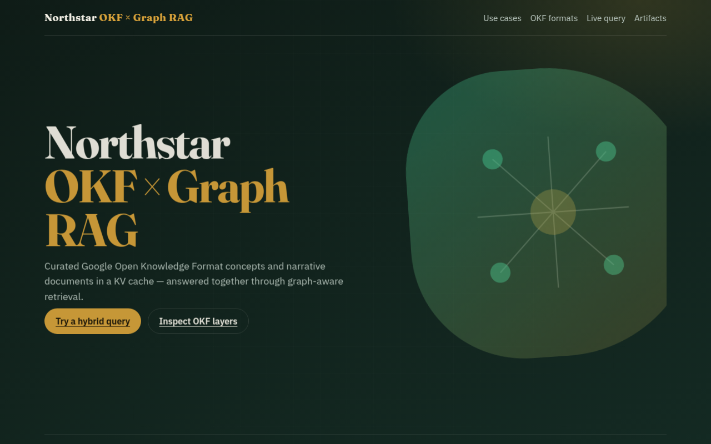
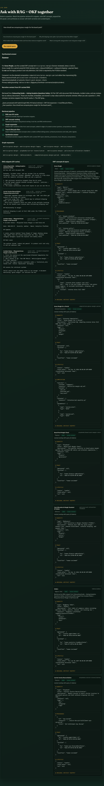
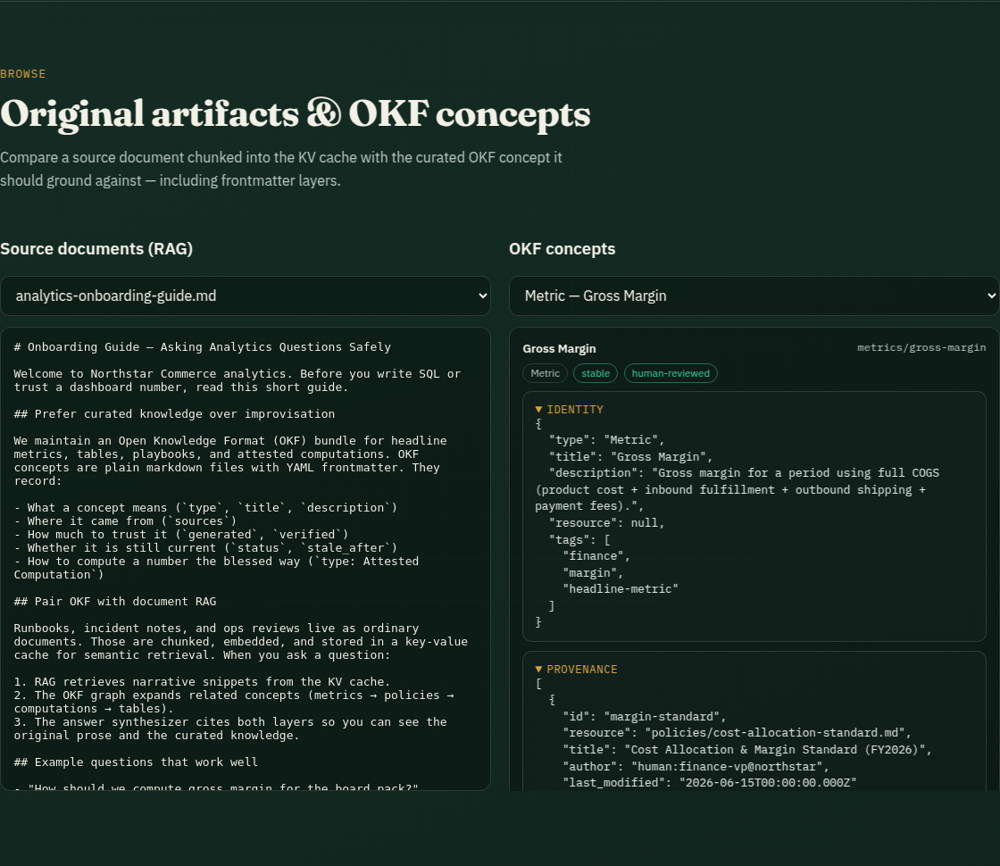

# OKF × Graph RAG Showcase

Interactive demo of [Google Open Knowledge Format (OKF) v0.2](https://github.com/GoogleCloudPlatform/open-knowledge-format) combined with Graph RAG and a KV-backed document cache.

**Domain:** Northstar Commerce — retail analytics knowledge (revenue, gross margin, carrier reconciliation).

**Live demos:**
- GitHub Pages (recommended): https://letslego.github.io/okf-graph-rag/
- Fly.io: https://okf-graph-rag.fly.dev/



## What this shows

1. **Document RAG → KV cache** — Unstructured ops memos / incident notes are chunked and stored in an in-process key-value cache for retrieval.
2. **OKF artifacts** — Curated concepts (Metrics, Tables, Policies, Playbooks, Attested Computations) as markdown + YAML frontmatter with identity, provenance, trust, lifecycle, and computation layers.
3. **Hybrid Graph RAG** — A user query retrieves narrative snippets, expands the OKF link graph, applies trust/lifecycle filters, and synthesizes an answer with both layers visible.





## Architecture

```
User query
   │
   ├─► RAG over KV cache (chunked source docs)
   │
   ├─► OKF concept ranking (lexical + trust boosts)
   │
   ├─► Graph expansion via markdown links
   │      metrics → policies → attested computations → tables
   │
   └─► Synthesized answer citing both layers
```

## Quick start

```bash
npm install
npm run dev
```

- Web UI: http://localhost:5173  
- API: http://localhost:8080/api/health  

Production build:

```bash
npm run build
npm start
```

## Sample content

| Path | Role |
|------|------|
| `content/source-docs/` | Original narrative artifacts ingested into the RAG KV cache |
| `content/okf/` | OKF v0.2 knowledge bundle (concepts + cross-links) |

## API

| Endpoint | Description |
|----------|-------------|
| `GET /api/overview` | Use cases, OKF field guide, corpus stats |
| `GET /api/kv` | KV cache snapshot (chunk previews) |
| `GET /api/okf` | Concept graph (nodes + edges) |
| `GET /api/okf/concept?id=` | Full concept with OKF layers |
| `POST /api/query` | `{ "query": "..." }` → hybrid answer |

## Deploy (Fly.io)

```bash
fly auth login
fly launch --copy-config --name okf-graph-rag --region sjc --yes
fly deploy
```

See `fly.toml` and `Dockerfile`.

## License

Apache-2.0. Sample content is fictional demo data inspired by the OKF v0.2 patterns from Google Cloud's open-knowledge-format repository.
